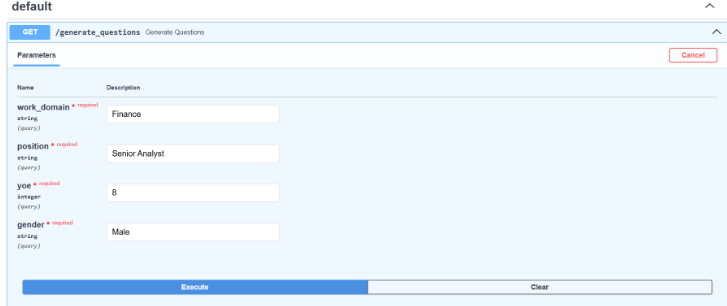

# Whiteboard-AI

# Personality Assessment System

## Overview
This project provides an API for generating personalized personality assessments, recommendations for improvement, and suggestions for relevant courses and mentors.

## Steps for local deployment
* Clone this repository
* Unzip the app_secrets folder shared via email and put the folder in the cloned location
* Run ```docker-compose up``` in the same location.
* The containers will automatically be created. Once the processes are completed, frontend will start running [here](http://localhost:8000) and api will be exposed [here](http://localhost:8001/docs)

## GCP Deployment links
* The code is already deployed on a GCP VM.
* Frontend is running [here](http://34.166.114.123:8000) and api is exposed [here](http://34.166.114.123:8001/docs)

## API Endpoints Documentations

### 1. /generate_questions
Generates a set of financial personality assessment questions with multiple choice options.

#### Input


#### Output
```json
{
  "questions": {
    "What motivates you when working on complex financial analysis projects?": [
      "I focus on mitigating potential financial risks and errors",
      "I concentrate on delivering accurate financial forecasts and targets"
    ],
    "How do you assess the quality of your financial analysis work?": [
      "I examine quantitative metrics and ROI to validate my analysis",
      "I rely on my market expertise and financial acumen",
      "I consult with stakeholders and senior management",
      "I combine both data-driven metrics and stakeholder feedback"
    ],
    "When assigned a new financial modeling project, how do you typically proceed?": [
      "I immediately start gathering relevant financial data",
      "I first develop a comprehensive analysis framework"
    ],
    "When making investment recommendations, what considerations take priority?": [
      "I focus on portfolio performance metrics",
      "I prioritize client investment objectives",
      "I ensure alignment between portfolio returns and client goals"
    ],
    "How do you handle complex financial analysis tasks?": [
      "I first understand the strategic business objective",
      "I begin by analyzing granular financial data",
      "I combine macro-economic factors with detailed financial metrics"
    ],
    "What is your approach to financial decision-making?": [
      "I evaluate multiple investment scenarios and alternatives",
      "I adhere to established risk management protocols"
    ],
    "How do you approach financial problem-solving?": [
      "I identify recurring market trends and correlations",
      "I analyze unique aspects of each financial situation",
      "I combine historical patterns with current market conditions"
    ],
    "When learning new financial analysis tools, what method works best for you?": [
      "Watching demonstrations of financial modeling techniques",
      "Understanding the theoretical framework behind financial concepts",
      "Practicing with real market data and scenarios",
      "Attending professional training sessions and workshops"
    ],
    "How do you validate your financial analysis findings?": [
      "I rely on empirical market data and statistics",
      "I apply established financial theories and models",
      "I draw from my previous market analysis experience",
      "I consider peer reviews and market consensus"
    ],
    "What timeframe do you consider when making financial recommendations?": [
      "I focus on current market conditions",
      "I analyze historical financial trends",
      "I project long-term market implications"
    ],
    "When initiating a new financial analysis project, what is your primary focus?": [
      "I prioritize quarterly deliverables and immediate financial metrics",
      "I evaluate long-term market trends and potential investment opportunities"
    ],
    "How do you prefer to receive financial data and market information?": [
      "I prefer summarized key performance indicators and executive summaries",
      "I need detailed financial statements and comprehensive market analysis",
      "I adapt my preference based on the complexity of the financial matter"
    ],
    "What factors do you believe determine success in financial analysis?": [
      "My analytical skills and investment decisions are the key determinants",
      "Market conditions and economic factors are the primary drivers",
      "Success depends on both personal expertise and market dynamics"
    ],
    "How do you approach financial discrepancies or analytical challenges?": [
      "I immediately investigate the variance and implement corrective measures",
      "I conduct thorough due diligence and consult historical data before making recommendations"
    ],
    "What's your preferred style when presenting financial insights to stakeholders?": [
      "I present data through sophisticated financial models and detailed analysis",
      "I provide clear, actionable insights with specific recommendations"
    ],
    "How do you approach investment decisions?": [
      "I make quick decisions based on market indicators and technical analysis",
      "I conduct extensive fundamental analysis and consider multiple scenarios"
    ],
    "How do you evaluate the reliability of new financial data sources?": [
      "I require multiple consistent reports before trusting the source",
      "I monitor the source's accuracy over several reporting periods",
      "I trust the source after one comprehensive, accurate report"
    ],
    "How do you handle portfolio management responsibilities?": [
      "I excel at personal portfolio analysis but struggle with team oversight",
      "I'm better at managing team performance than my own assignments",
      "I understand my analysis approach but find it hard to guide others",
      "I effectively balance both personal analysis and team guidance"
    ],
    "What role do you find most rewarding in financial projects?": [
      "Leading financial strategy and directing investment decisions",
      "Collaborating with analysts on complex financial models",
      "Conducting independent research and analysis"
    ],
    "What type of financial work engages you most?": [
      "Developing and implementing financial systems and processes",
      "Executing specific trading or investment strategies",
      "Client relationship management and stakeholder communication"
    ],
    "What aspects of financial analysis do you find most engaging in your work?": [
      "The precision and accuracy of financial modeling and forecasting",
      "The detailed statistical data and market research components",
      "The collaborative environment of the trading floor",
      "The dynamic nature of market analysis and risk assessment"
    ],
    "How do you handle high-pressure situations during market volatility?": [
      "I rely on my market intuition and gut feelings",
      "I evaluate multiple scenarios before taking action",
      "I strictly follow established risk management protocols"
    ],
    "How do you approach historical market data analysis and future projections?": [
      "I balance historical trends with current market conditions to make future predictions",
      "I analyze past performance metrics to forecast future market behavior"
    ],
    "When analyzing complex financial reports, how do you prefer to process the information?": [
      "I start with executive summaries and key highlights",
      "I examine individual financial statements before consolidating findings",
      "I review the overall market impact before analyzing specific metrics",
      "I focus on granular transaction data initially"
    ],
    "How do you respond when a stakeholder indicates potential liquidity concerns?": [
      "I note the concern for future reference without immediate action",
      "I immediately prepare a detailed liquidity analysis report"
    ],
    "How do you prefer to address underperforming investment strategies with team members?": [
      "I suggest alternative approaches through indirect feedback",
      "I conduct a direct performance review with specific recommendations"
    ],
    "When analyzing market trends and competitor performance, what do you typically focus on?": [
      "I identify unique market positioning and competitive advantages",
      "I evaluate both market similarities and distinctive features",
      "I look for common patterns in market behavior"
    ]
  }
}

```

### 2. /get_report
Generates a comprehensive assessment report based on the user's answers to the questions.

#### Input
A dictionary mapping questions to the user's selected answers:

```json
 {
"What motivates you when working on complex financial analysis projects?":"I focus on mitigating potential financial risks and errors",
"How do you assess the quality of your financial analysis work?":"I examine quantitative metrics and ROI to validate my analysis",
"When assigned a new financial modeling project, how do you typically proceed?":"I immediately start gathering relevant financial data",
"When making investment recommendations, what considerations take priority?":"I focus on portfolio performance metrics",
"How do you handle complex financial analysis tasks?":"I first understand the strategic business objective",
"What is your approach to financial decision-making?":"I evaluate multiple investment scenarios and alternatives",
"How do you approach financial problem-solving?":"I identify recurring market trends and correlations",
"When learning new financial analysis tools, what method works best for you?":"Watching demonstrations of financial modeling techniques",
"How do you validate your financial analysis findings?":"I rely on empirical market data and statistics",
"What timeframe do you consider when making financial recommendations?":"I focus on current market conditions",
"When initiating a new financial analysis project, what is your primary focus?":"I prioritize quarterly deliverables and immediate financial metrics",
"How do you prefer to receive financial data and market information?":"I prefer summarized key performance indicators and executive summaries",
"What factors do you believe determine success in financial analysis?":"My analytical skills and investment decisions are the key determinants",
"How do you approach financial discrepancies or analytical challenges?":"I immediately investigate the variance and implement corrective measures",
"What's your preferred style when presenting financial insights to stakeholders?":"I present data through sophisticated financial models and detailed analysis",
"How do you approach investment decisions?":"I make quick decisions based on market indicators and technical analysis",
"How do you evaluate the reliability of new financial data sources?":"I require multiple consistent reports before trusting the source",
"How do you handle portfolio management responsibilities?":"I excel at personal portfolio analysis but struggle with team oversight",
"What role do you find most rewarding in financial projects?":"Leading financial strategy and directing investment decisions",
"What type of financial work engages you most?":"Developing and implementing financial systems and processes",
"What aspects of financial analysis do you find most engaging in your work?":"The precision and accuracy of financial modeling and forecasting",
"How do you handle high-pressure situations during market volatility?":"I rely on my market intuition and gut feelings",
"How do you approach historical market data analysis and future projections?":"I balance historical trends with current market conditions to make future predictions",
"When analyzing complex financial reports, how do you prefer to process the information?":"I start with executive summaries and key highlights",
"How do you respond when a stakeholder indicates potential liquidity concerns?":"I note the concern for future reference without immediate action",
"How do you prefer to address underperforming investment strategies with team members?":"I suggest alternative approaches through indirect feedback",
"When analyzing market trends and competitor performance, what do you typically focus on?":"I identify unique market positioning and competitive advantages"
}
```

#### Output
JSON containing visualization data and assessment results:

```json
{
  "spider_plot": {
    "theta": [
      "Achievement",
      "Motivation",
      "Conscientiousness",
      "Assertiveness",
      "Extroversion",
      "Cooperativeness",
      "Competitiveness",
      "Patience",
      "Self-confidence",
      "Openness"
    ],
    "r": [
      8.5,
      7.5,
      8,
      6.5,
      5.5,
      6,
      7.5,
      6.5,
      7.5,
      6
    ]
  },
  "strength_chart": {
    "labels": [
      "Analytical Thinking",
      "Risk Management",
      "Technical Expertise",
      "Decision Making",
      "Strategic Planning"
    ],
    "data": [
      9,
      8.5,
      8,
      7.5,
      7
    ]
  },
  "weakness_chart": {
    "labels": [
      "Team Collaboration",
      "Stakeholder Management",
      "Communication",
      "Emotional Intelligence",
      "Adaptability"
    ],
    "data": [
      6,
      5.5,
      5,
      4.5,
      4
    ]
  },
  "improvements": [
    "Develop better team collaboration skills",
    "Enhance stakeholder communication",
    "Work on emotional intelligence",
    "Improve adaptability to change",
    "Strengthen interpersonal relationships"
  ],
  "key_insights": {
    "strength": [
      "Strong analytical and quantitative skills",
      "Excellent risk assessment capabilities",
      "Detail-oriented financial modeling",
      "Quick decision-making ability",
      "Strategic thinking and planning"
    ],
    "weakness": [
      "Limited team collaboration",
      "Poor stakeholder engagement",
      "Indirect communication style",
      "Overreliance on technical analysis",
      "Resistance to change"
    ]
  },
  "workplace_stressors": [
    {
      "stressor": "Having to work alone",
      "score": 2
    },
    {
      "stressor": "Open discussions",
      "score": 4
    },
    {
      "stressor": "Rigid enforcement of rules",
      "score": 3
    },
    {
      "stressor": "Change in workplace expectations or job duties",
      "score": 4
    },
    {
      "stressor": "A narrowly defined role",
      "score": 3
    },
    {
      "stressor": "Having clear and well articulated goals",
      "score": 2
    },
    {
      "stressor": "Being exposed to frequent conflict",
      "score": 4
    },
    {
      "stressor": "Taking the lead in group settings",
      "score": 3
    }
  ]
}

```

### 3. /recommend_courses
Recommends courses based on identified areas for improvement.

#### Input
```json
{
  "topics": [
    "Develop better team collaboration skills",
    "Enhance stakeholder communication",
    "Work on emotional intelligence",
    "Improve adaptability to change",
    "Strengthen interpersonal relationships"
  ],
  "gender": "Male"
}
```

#### Output
```json
 {
  "recommended_courses": [
    {
      "Program": "Basics of Communication Skills",
      "Score": 9,
      "Link": "https://dev.whiteboard.com.sa/courses/basics-of-communication-skills/",
      "A_link": "https://dev.whiteboard.com.sa/courses/basics-of-communication-skills-2/"
    },
    {
      "Program": "Leadership Training Program",
      "Score": 9,
      "Link": "https://dev.whiteboard.com.sa/courses/leadership-training-program-2/",
      "A_link": "https://dev.whiteboard.com.sa/courses/leadership-training-program/"
    },
    {
      "Program": "Leadership Development Program",
      "Score": 9,
      "Link": "https://dev.whiteboard.com.sa/courses/leadership-development-program/",
      "A_link": ""
    },
    {
      "Program": "How People Tick (Metaprograms Workshop)",
      "Score": 8,
      "Link": "https://dev.whiteboard.com.sa/courses/how-people-tick-metaprograms-workshop/",
      "A_link": "https://dev.whiteboard.com.sa/courses/how-people-tick-metaprograms-workshop-2/"
    },
    {
      "Program": "Adaptive Leadership",
      "Score": 8,
      "Link": "https://dev.whiteboard.com.sa/courses/adaptive-leadership/",
      "A_link": ""
    }
  ]
}

```

### 4. /recommend_mentors
Recommends mentors based on identified areas for improvement.

#### Input
```json
{
  "topics": [
    "Develop better team collaboration skills",
    "Enhance stakeholder communication",
    "Work on emotional intelligence",
    "Improve adaptability to change",
    "Strengthen interpersonal relationships"
  ],
  "gender": "Male"
}
```

#### Output
```json
 {
  "recommended_mentors": [
    {
      "Mentor": "Martine Geagea",
      "Profile Link": "https://dev.whiteboard.com.sa/coach/martine-geagea/",
      "Image Link": "https://dev.whiteboard.com.sa/wp-content/uploads/2025/01/4.jpg"
    },
    {
      "Mentor": "Jaspreet Bhatia",
      "Profile Link": "https://dev.whiteboard.com.sa/coach/jaspreet-bhatia/",
      "Image Link": "https://dev.whiteboard.com.sa/wp-content/uploads/2024/12/1-1.jpg"
    },
    {
      "Mentor": "Andy Smith",
      "Profile Link": "https://dev.whiteboard.com.sa/coach/andy-smith/",
      "Image Link": "https://dev.whiteboard.com.sa/wp-content/uploads/2024/11/team-6.jpg"
    }
  ]
}

```

## Implementation Notes
- The system provides personalized personality assessments
- Visualizations include spider plots, strength/weakness charts, and stressor evaluations
- Course and mentor recommendations are tailored to identified improvement areas
- The API can be integrated with any frontend UI for displaying results

## Usage
These endpoints can be integrated into a web or mobile application to provide users with a comprehensive personality assessment and personalized development recommendations.
